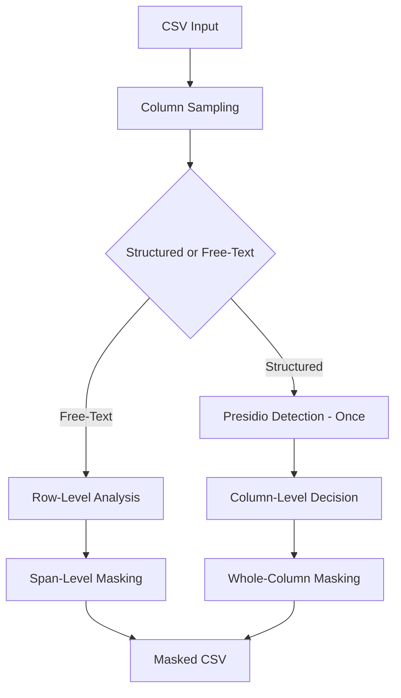

# 🛡️ PII Detection & Masking Tool

A deterministic, scalable **PII detection and masking system** built using **Microsoft Presidio**, with a **Streamlit frontend** for interactive analysis and CSV export.

This project prioritizes **correctness, explainability, and performance** — not heuristics, regex shortcuts, or probabilistic hacks.

---

## ✨ Features

* Column-level PII detection for structured data
* Row-level span masking for free-text data
* Robust sampling for large datasets
* Deterministic and auditable decisions
* Streamlit UI for upload, review, and download
* No regex hacks
* No model changes
* Presidio used **only for detection**

---

## 📌 Core Insight

> **Presidio performs poorly on isolated structured values.**

NER models expect **linguistic context**.
Structured values like phone numbers, emails, or IDs often fail detection when analyzed alone.

---

## ✅ Key Fix: Context Injection

Instead of analyzing raw values:

```text
9876543210
```

We analyze:

```text
The value is 9876543210
```

This provides the **minimal linguistic structure** required for Presidio’s NER models to behave correctly.

Everything else in this project builds on this fix.

---

## 🧠 High-Level Architecture



---

## 🗂️ Folder Structure

```text
pii-detector/
│
├── app.py                 # Streamlit entry point
├── requirements.txt
├── README.md
│
├── core/
│   ├── __init__.py
│   ├── detector.py        # Final detection + masking logic
│   ├── sampling.py        # Robust sampling logic
│   ├── free_text.py       # Free-text detection & masking
│   └── policy.py          # Explicit non-PII entity policy
│
└── outputs/
    └── masked.csv
```

---

## ⚙️ Detection Strategy

### Structured Columns

* Sample column values using a **bounded sampling strategy**
* Inject neutral linguistic context:

```python
text = f"The value is {item}"
```

* Run Presidio **once per sampled value**
* Compute **absolute entity density** across samples
* Mask the entire column if a dominant PII entity is detected
* **No per-cell re-detection**

---

### Free-Text Columns

* Identified using heuristics (length + word count)
* Masked **row by row**
* Span-level masking inside sentences
* Preserves surrounding text and readability

---

## 🚫 Explicitly Non-PII Entities

The following entities are **intentionally excluded** from masking:

```python
SKIP_PII_ENTITIES = {"DATE_TIME", "NRP", "LOCATION"}
```

This is a **semantic policy decision**.

---

## 🔐 Masking Strategy

### Structured PII

* Whole-cell replacement

```text
<PHONE_NUMBER>
```

---

### Free-Text PII

* Span-level replacement inside sentences

```text
"Contact John at 9876543210"
→ "Contact <PERSON> at <PHONE_NUMBER>"
```

> Masking for structured data.

---

## 🚀 Streamlit UI

The Streamlit application allows users to:

* Upload a CSV file
* Preview data
* Run PII detection
* Review column-wise PII summary
* Download masked CSV

---

## ▶️ Running Locally

### 1. Create virtual environment

```bash
python -m venv venv
source venv/bin/activate      # Windows: venv\Scripts\activate
```

### 2. Install dependencies

```bash
pip install -r requirements.txt
```

### 3. Run Streamlit

```bash
streamlit run app.py
```

---

## 📦 requirements.txt

```text
streamlit
pandas
numpy
presidio-analyzer
spacy
```

Uses Presidio’s **default spaCy model**.
No transformer models required.

---

## ⚡ Performance Notes

* Presidio NER is **CPU-heavy by nature**
* Structured data is optimized via **sampling**
* Free-text masking requires **per-row NLP** (unavoidable)
* Streamlit may appear “stuck” during computation — this is expected

---

## ❌ What This Tool Intentionally Avoids

* Regex-based guessing
* Hardcoded PII severity rules
* Conditional density hacks
* Per-cell structured masking
* Model modification or fine-tuning

---

## 🧭 Limitations

* Single-token names may be missed by NER
* Free-text masking is computationally expensive
* Conservative by design (prefers false negatives over false positives)

---

## 📌 Final Takeaway

The hardest problem was **not masking** —
it was making **NER work correctly on structured data**.

Once **context injection** was introduced, the system became:

* **Predictable**
* **Scalable**
* **Explainable**
**real, production-grade PII pipeline**.
